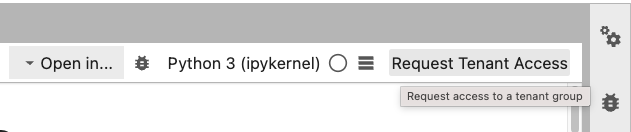
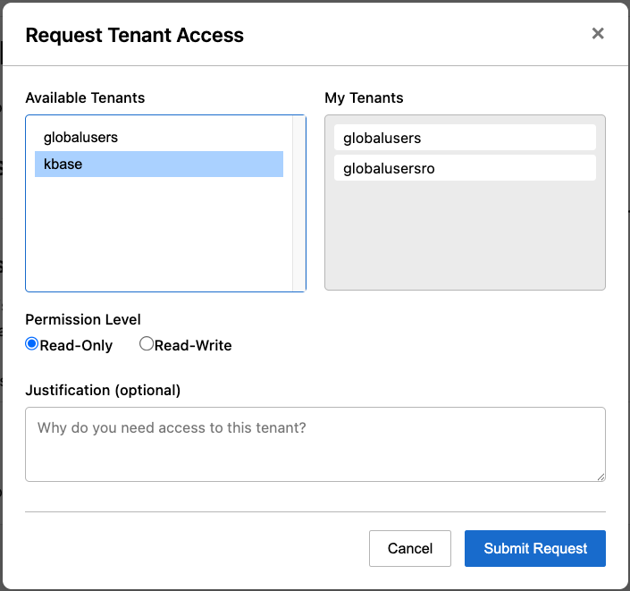

# Requesting Tenant Access

This guide explains how to request access to tenant groups in BERDL JupyterHub.

---

## Overview

**Tenants** are shared data spaces where team members can collaborate. Each tenant has:
- **Read-only access** (`read_only`) - View and download data
- **Read-write access** (`read_write`) - Full access to create, modify, and delete data

Access requests go through an admin approval workflow via Slack.

---

## Method 1: Toolbar Button (Recommended)

The easiest way to request access is using the **Request Tenant Access** button in the notebook toolbar.

### Step 1: Open a Notebook

Open any notebook in JupyterLab. You'll see a **"Request Tenant Access"** button in the toolbar.



### Step 2: Click the Button

Click **Request Tenant Access** to open the access request dialog.

### Step 3: Fill Out the Form

1. **Select a Tenant** - Choose from the available tenants
2. **View Your Tenants** - See which tenants you already belong to
3. **Select Permission Level** - Choose Read-Only or Read-Write
4. **Add Justification** (optional) - Explain why you need access



### Step 4: Submit

Click **Submit Request**. Your request will be sent to a KBase admin for approval.

### Step 5: Wait for Approval

Admins will review and approve/deny your request. Approvals typically happen within a few hours during business hours.

---

## Method 2: Python Commands (Fallback)

If the toolbar button isn't available, you can use Python commands directly in a notebook cell.

### Step 0: List Available Groups

```python
# List all available groups
groups = list_available_groups()
print(f"Available groups: {groups}")
# Output: Available groups: ['kbase', 'research', 'shared-data']
```

### Step 1: Submit Your Request

```python
# Request read-only access
result = request_tenant_access(
    tenant_name="kbase",
    permission="read_only",
    justification="Need access for data analysis project"
)
print(result['message'])
```

**Parameters:**
| Parameter | Required | Description |
|-----------|----------|-------------|
| `tenant_name` | Yes | Name of the tenant you want to access |
| `permission` | Yes | `"read_only"` or `"read_write"` |
| `justification` | No | Reason for your request (helps admins approve faster) |

### Step 2: Verify Your Access

After approval, check your group memberships:

```python
groups = get_my_groups()
print(f"Your groups: {groups.groups}")
```

---

## Permission Levels Explained

| Permission | Group Suffix | What You Can Do |
|------------|--------------|-----------------| 
| `read_only` | `ro` | View files, download data, list contents |
| `read_write` | (none) | All read_only permissions + upload, modify, delete |

---

## Examples (Python Commands)

### Request Read-Only Access

```python
request_tenant_access(
    tenant_name="research-data",
    permission="read_only",
    justification="Need to review team datasets for quarterly report"
)
```

### Request Read-Write Access

```python
request_tenant_access(
    tenant_name="shared-project",
    permission="read_write",
    justification="Collaborating on ML pipeline, need to upload processed data"
)
```

---

## FAQ

**Q: Which method should I use?**
A: Use the **toolbar button** (Method 1) - it's faster and easier. Use Python commands only if the button isn't available.

**Q: How do I know which groups are available?**
A: The toolbar dialog shows all available groups. Or use `list_available_groups()` in Python.

**Q: How long does approval take?**
A: Approvals are processed when an admin reviews the Slack notification. Typically same-day during business hours.

**Q: Can I request access to multiple tenants?**
A: Yes, submit a separate request for each tenant.

**Q: Can I upgrade from read_only to read_write?**
A: Yes, submit a new request with `permission="read_write"` (or select Read-Write in the dialog).

---
