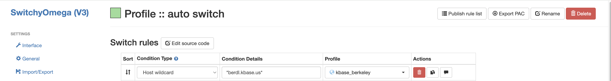
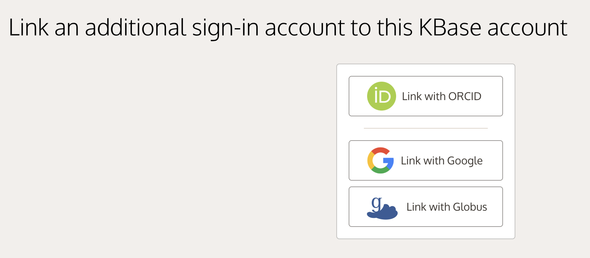
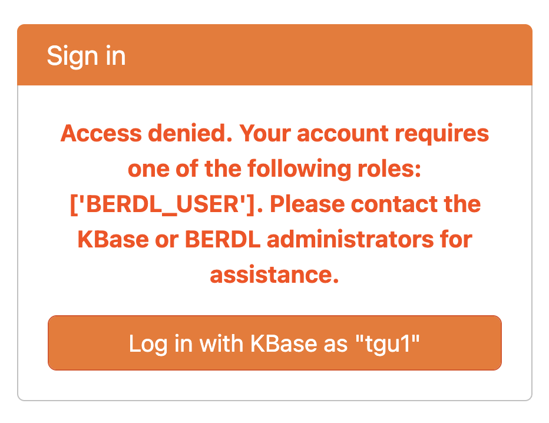

# User Guide: Accessing BERDL JupyterHub

## Prerequisites

### SSH Access:
   * Ensure you have SSH access to the remote server (`login1.berkeley.kbase.us`).
   * If you do not have access, please contact the KBase System Admin team.

## Step-by-Step Guide

### 1. Create SSH Tunnel:

You need to create a secure tunnel from your local machine to the KBase server to access JupyterHub securely.

**Step 1:** Open a terminal on your machine and run the following command:

```bash
ssh -f -D 1338 <ac.anl_username>@login1.berkeley.kbase.us "/bin/sleep infinity"
```

**What this command does:**
* `-f`: Runs SSH in the background
* `-D 1338`: Creates a SOCKS5 proxy on port 1338
* `<ac.anl_username>`: Replace with your actual username
* `"/bin/sleep infinity"`: Keeps the connection open indefinitely

> **⚠️ Note:** If port `1338` is already in use on your system, you can replace it with another free port (e.g., 1080).

**Step 2:** If you haven't set up SSH keys, you'll be prompted to enter your password.

**Step 3:** Verify the tunnel is running by checking for the background process:
```bash
ps aux | grep "ssh -f -D 1338"
```

> **💡 Tip:** To close the tunnel later, find the process ID (PID) and terminate it with `kill <PID>`.

### 2. Configure Your Browser to Use the SOCKS5 Proxy:

#### Option A: Using SwitchyOmega Extension (Recommended)

SwitchyOmega provides a convenient way to manage and switch between different proxy configurations.

**Step 1: Install the Extension**
* [Chrome Web Store](https://chromewebstore.google.com/detail/proxy-switchyomega-3-zero/pfnededegaaopdmhkdmcofjmoldfiped)
* [Firefox Add-ons](https://addons.mozilla.org/en-US/firefox/addon/switchyomega/)

**Step 2: Configure Proxy Profile**
1. Click on the SwitchyOmega icon in your browser toolbar and select "Options"
2. Click "New Profile" 
3. Select "Proxy Profile" from the profile type options
4. Name it "kbase_berkeley"
5. Configure the following settings:
   * Protocol: SOCKS5
   * Server: 127.0.0.1
   * Port: 1338 (or the port you specified in your SSH command)
6. Click "Apply Changes" to save your configuration


**Step 3: Set Up Auto Switch (Optional)**
This configuration allows you to use the proxy only for KBase services while maintaining direct connections for other websites.

1. Create another profile:
   * Click "New Profile"
   * Select "Switch Profile" from the profile type options
   * Name it "Auto Switch"
2. Configure the switch rules:
   * Create a routing rule for BERDL servers (using wildcard pattern `*.berdl.kbase.us*`) that directs traffic through your "kbase_berkeley" profile
   * Set the default profile to "Direct" (or your system default)
3. Click "Apply Changes" to save your configuration



**Step 4: Activate the Proxy**
* Click the SwitchyOmega icon in your browser toolbar
* Select either:
  * "Auto Switch" to only proxy KBase traffic (recommended)
  * "kbase_berkeley" to route all traffic through the proxy
  

#### Option B: Manual Browser Configuration

If you prefer not to use an extension, you can configure proxy settings directly in your browser:

**Chrome/Edge:**
1. Open Settings → Advanced → System → Open proxy settings
2. Follow your operating system's proxy configuration dialog
3. Set up a SOCKS proxy with:
   * Host: 127.0.0.1
   * Port: 1338
   * Type: SOCKS5

**Firefox:**
1. Open Settings → General → Network Settings
2. Select "Manual proxy configuration"
3. Configure the SOCKS proxy:
   * Host: 127.0.0.1
   * Port: 1338
   * Type: SOCKS v5
   * Check "Proxy DNS when using SOCKS v5"
4. Click "OK" to save

> **⚠️ Important:** Remember to switch your browser back to its regular connection when you're done using BERDL JupyterHub.

### 3. Access BERDL JupyterHub:

**Step 1:** Open a web browser with your configured proxy active

**Step 2:** Navigate to the appropriate BERDL JupyterHub URL based on your environment:

**Development Environment:**
```
https://hub.dev.berdl.kbase.us/
```

**Staging Environment:**
```
https://hub.stage.berdl.kbase.us/
```

**Production Environment:**
```
https://hub.berdl.kbase.us/
```

This will open the JupyterHub login interface running on the remote server.


**Step 3:** Log in using your KBase credentials (the same 3rd party identity provider, username and password you use for KBase services).

> **⚠️ Important Authentication Requirements:**
> - If you don't have a KBase account yet, you'll need to register at https://narrative.kbase.us/ before proceeding.
> - **Your KBase account must be linked to ORCID**
>   - To link your ORCID account: At https://narrative.kbase.us/ → Click on your username (top right) → My Account → Linked Providers → Link with ORCID
>
>      
>
> - **Multi-Factor Authentication (MFA) must be enabled on your ORCID account for security**
>   - To enable MFA: Go to https://orcid.org/account → Click on your username → Account settings → Two-factor authentication
>
>      
>
> - **Your account must be added to the BERDL_USER group**
>   - If you see an error message like the one below, please [contact the KBase Platform team](https://docs.kbase.us/troubleshooting/support) to have your KBase account added to the appropriate user group.
>
>      

### 4. Data Access:
By default, you have **read/write access** to:
- Your personal SQL warehouse (`s3a://cdm-lake/users-sql-warehouse/{username}/`)
- Any tenant SQL warehouses that you belong to (e.g., `s3a://cdm-lake/tenant-sql-warehouse/kbase/`)

For questions about data access or permissions, please reach out to the BERDL Platform team.

### 5. Access the Workspace:
#### 5.1 Home Directory:
After logging in, click on `username` (your KBase username) under the `FAVORITES` section to access your personal home directory. 
This directory is exclusive to your account and is where you can store your notebooks and files.

#### 5.2 Shared Directory:
To access shared resources and example notebooks, click on the `Global Share` folder icon. This directory contains shared content available to all users.

### 6. Using Pre-loaded Functions:

BERDL JupyterHub automatically loads helper functions and utilities when you start a notebook. These are imported from [berdl_notebook_utils](../notebook_utils/berdl_notebook_utils) and are immediately available without any imports needed!

#### 6.1. Creating a Spark Session:

Use the `get_spark_session()` function to create or get a Spark session with all necessary configurations:

```python
spark = get_spark_session()
```

This automatically configures:
- Spark Connect server connection
- Hive Metastore integration
- MinIO S3 access
- Delta Lake support

#### 6.2. Displaying DataFrames:

Use the standard `show()` method to display Spark DataFrames:

```python
# Display DataFrame using show()
df = spark.sql("SELECT * FROM my_namespace.my_table")
df.show()
```

**For formatted, interactive display with CSV-like formatting:**

If you would like to display your DataFrame in a formatted table with sorting, filtering, and pagination capabilities, use `display_df()`:

```python
# Display DataFrame in interactive table format
display_df(df)
```


> **⚠️ Warning:** `display_df()` converts Spark DataFrames to pandas DataFrames and loads the entire DataFrame into memory. Only use this for reasonably-sized datasets that can fit in memory. For large datasets, use `show()` or `limit()` the results first:
> ```python
> # Safe for large datasets - limit rows first
> display_df(df.limit(100))
> ```

### 7. Accessing Data:

BERDL provides prebuilt functions to explore and query your data. All functions are automatically loaded - no imports needed!

#### 7.1 Listing Databases (Namespaces):

Use `get_databases()` to list all namespaces you have access to:

```python
# Get list of all databases/namespaces
databases = get_databases()
print(f"Available databases: {databases}")
```

#### 7.2 Listing Tables in a Database:

Use `get_tables()` to list all tables in a specific namespace:

```python
# List all tables in a namespace
tables = get_tables("my_namespace")
print(f"Tables in my_namespace: {tables}")
```

#### 7.3 Getting Table Schema:

Use `get_table_schema()` to view the structure of a table:

```python
# Get schema information for a table
schema = get_table_schema("my_namespace", "my_table")
display_df(schema)
```

#### 7.4 Getting Complete Database Structure:

Use `get_db_structure()` to see all tables and their schemas in a namespace:

```python
# Get complete structure of a database
db_structure = get_db_structure("my_namespace")
for table_info in db_structure:
    print(f"Table: {table_info['table']}")
    print(f"Columns: {table_info['columns']}")
```